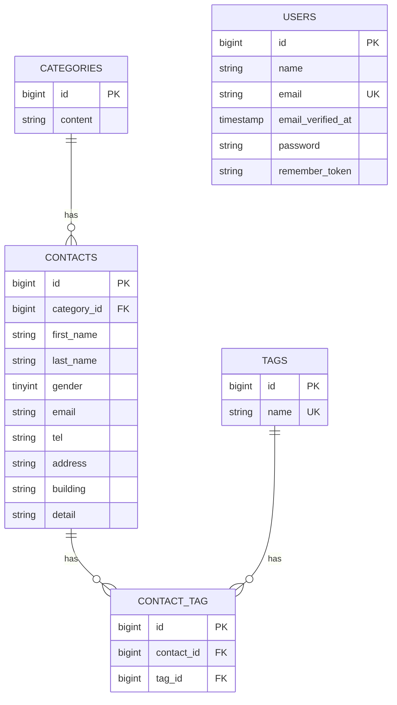

# お問い合わせフォーム

coachtech 基礎学習ターム 確認テスト お問い合わせフォームのプロジェクトです。

## 概要

本システムは、一般ユーザーが利用する公開のお問い合わせフォームです。
<br>誰でもお問い合わせを送信でき、管理者はログイン後にその内容を確認・管理します。

### 目的

確認テストを通して、教材で学んだバックエンド技術（Laravel, DB設計, テスト）を実践的にアウトプットし、復習箇所を洗い出すこと。
<br>※フロントエンド実装は、完成品として提供されたBladeテンプレートを使用しています。

### 実装機能

- お問い合わせフォーム（入力 → 確認 → 送信 → 完了）
- 管理者登録・ログイン（Laravel Fortify）
- 管理画面（一覧表示・キーワード/性別/カテゴリ/日付での検索・ページネーション）
- お問い合わせ詳細表示・削除
- タグ管理（追加・編集・削除）
- お問い合わせ一覧のCSVエクスポート
- 認証不要の公開API（お問い合わせのCRUD）

## ER図



- `categories` 1 対多 `contacts`（カテゴリ削除時は `ON DELETE CASCADE`）
- `contacts` と `tags` は `contact_tag` 中間テーブルを介した多対多（`UNIQUE(contact_id, tag_id)`、両側とも `ON DELETE CASCADE`）
- `users` は他テーブルと直接のリレーションを持たない（管理画面ログイン専用アカウント）

## 環境構築手順

以下はDocker（Laravel Sail）を利用した構築手順です。

### 前提

- Docker Desktop がインストール・起動していること
- （Apple Siliconの場合）後述の手順で `compose.yaml` に1行追記が必要です

### 手順

1. リポジトリをクローンします。

    ```bash
    git clone git@github.com:Saito-N01/contact-form-app.git
    cd contact-form-app
    ```

2. `.env.example` を `.env` にコピーします。

    ```bash
    cp .env.example .env
    ```

3. `.env` のDB接続情報を確認します（Sail利用時は `DB_HOST=mysql` である必要があります。`localhost` ではコンテナ間通信ができません）。

    ```
    DB_CONNECTION=mysql
    DB_HOST=mysql
    DB_PORT=3306
    DB_DATABASE=laravel
    DB_USERNAME=sail
    DB_PASSWORD=password
    ```

4. Composerの依存パッケージをインストールします（初回のみ、ローカルにPHP/Composerが無い場合はDockerを使って実行します）。

    ```bash
    docker run --rm \
      -u "$(id -u):$(id -g)" \
      -v "$(pwd):/var/www/html" \
      -w /var/www/html \
      laravelsail/php83-composer:latest \
      composer install --ignore-platform-reqs
    ```

5. （Apple Siliconの場合のみ）`compose.yaml` の `mysql` サービスに以下を追記します。

    ```yaml
    mysql:
        image: "mysql/mysql-server:8.0"
        platform: "linux/amd64" # ← この行を追加
        # ...既存の設定...
    ```

6. Sailを起動します。

    ```bash
    ./vendor/bin/sail up -d
    ```

7. アプリケーションキーを生成します。

    ```bash
    ./vendor/bin/sail artisan key:generate
    ```

8. マイグレーションとシーディングを実行します。

    ```bash
    ./vendor/bin/sail artisan migrate --seed
    ```

9. フロントエンドの依存パッケージをインストールし、ビルドします。

    ```bash
    ./vendor/bin/sail npm install
    ./vendor/bin/sail npm run dev
    ```

10. ブラウザで [http://localhost](http://localhost) にアクセスして動作を確認します。

### シーディングされる初期データ

| 項目                 | 値                                                                                                  |
| -------------------- | --------------------------------------------------------------------------------------------------- |
| 管理者メールアドレス | `test@example.com`                                                                                  |
| 管理者パスワード     | `password`                                                                                          |
| カテゴリ             | 固定5件（商品のお届けについて／商品の交換について／商品トラブル／ショップへのお問い合わせ／その他） |
| タグ                 | 固定5件（質問／要望／不具合報告／ご意見／その他）                                                   |
| お問い合わせ         | Faker（ja_JP）による20件のダミーデータ、各1〜3件のタグ付き                                          |

### テストの実行

```bash
./vendor/bin/sail artisan test
./vendor/bin/sail artisan test --coverage
```

## 使用技術

| 分類           | 技術                                    |
| -------------- | --------------------------------------- |
| 言語           | PHP 8.x                                 |
| フレームワーク | Laravel 10.x                            |
| 認証           | Laravel Fortify                         |
| データベース   | MySQL 8.x                               |
| フロントエンド | Blade / Tailwind CSS / Alpine.js / Vite |
| 開発環境       | Docker / Laravel Sail                   |
| テスト         | PHPUnit                                 |
| コード整形     | Laravel Pint                            |

## APIエンドポイント一覧

ベースURL：`/api/v1`

| メソッド | パス             | 概要                                                                                           |
| -------- | ---------------- | ---------------------------------------------------------------------------------------------- |
| GET      | `/contacts`      | お問い合わせ一覧取得（keyword/gender/category_id/dateで検索、page/per_pageでページネーション） |
| GET      | `/contacts/{id}` | お問い合わせ詳細取得                                                                           |
| POST     | `/contacts`      | お問い合わせ新規作成                                                                           |
| PUT      | `/contacts/{id}` | お問い合わせ更新（タグは送信内容で完全に置き換え）                                             |
| DELETE   | `/contacts/{id}` | お問い合わせ削除                                                                               |

- バリデーションエラー時は `422` とエラー内容をJSONで返却
- 対象IDが存在しない場合は `404` と `{"error": "お問い合わせが見つかりませんでした。"}` を返却

## 開発環境URL

- アプリケーション: [http://localhost](http://localhost)
- 管理画面: [http://localhost/admin](http://localhost/admin)
- phpMyAdmin: [http://localhost:8080](http://localhost:8080)

## 備考

- お問い合わせフォームの確認画面で「修正」ボタンを押した際、ブラウザの `history.back()` を使う実装だと、ブラウザのキャッシュ（bfcache）によって入力値（特に電話番号の3分割入力欄）が保持されない場合があったため、確認画面のhidden項目をサーバーへ送信して`withInput()`でセッションにflashし直す方式に変更しています。
- 提供されたBladeファイルが`first_tname` = 姓、`last_name` = 名 の形式で実装されています。正しくは`first_tname` = 名、`last_name` = 姓 なので修正対応をお願いします。（本プロジェクトでは修正対応は行っていません。）

## 作成者

斎藤 直人
